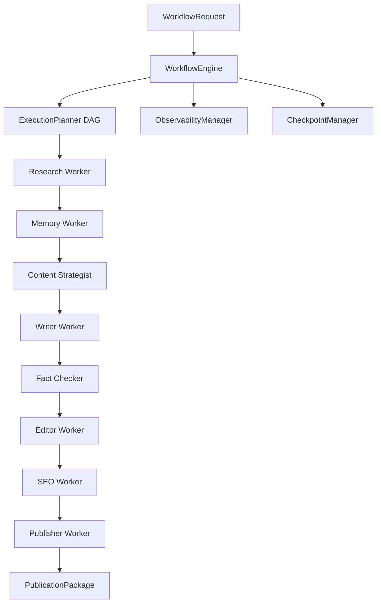

<!-- Repository Banner Placeholder -->
<p align="center">
  
</p>

# AI Content OS 🚀

<p align="center">
  <a href="https://github.com/mayank30-09/ai-content-os/actions/workflows/ci.yml"></a>
  <a href="https://github.com/mayank30-09/ai-content-os"></a>
  <a href="https://github.com/mayank30-09/ai-content-os"></a>
  <a href="LICENSE"></a>
  <a href="https://python.org"></a>
  <a href="https://github.com/astral-sh/ruff"></a>
  <a href="docker/Dockerfile"></a>
  <a href="https://github.com/mayank30-09/ai-content-os/releases"></a>
  <br />
  <a href="https://github.com/mayank30-09/ai-content-os/stargazers"></a>
  <a href="https://github.com/mayank30-09/ai-content-os/network/members"></a>
  <a href="https://github.com/mayank30-09/ai-content-os/issues"></a>
  <a href="https://github.com/mayank30-09/ai-content-os/pulls"></a>
  <a href="https://github.com/mayank30-09/ai-content-os/commits/main"></a>
</p>

---

## ❓ Why AI Content OS?

### The Problem
Traditional AI content generation scripts produce low-quality, single-prompt text riddled with factual hallucinations, poor formatting, unverified claims, and zero publishing capabilities. Developers building enterprise media automation lack a structured framework to coordinate research, memory, quality scoring, SEO, and multi-platform distribution.

### Who It Is Built For
AI Content OS is built for **Engineering Teams, AI Developers, Content Operations Leaders, and Media Organizations** who require production-ready, fault-tolerant AI pipelines capable of operating autonomously at scale.

### Key Differentiators
- **Modular Workforce Architecture**: 8 specialized AI workers operating in isolated, testable single-responsibility layers.
- **Strongly-Typed Lineage**: Immutable records (`VerificationReport`, `EditQualityScores`, `SEOScores`) preserved across DAG steps.
- **Zero-Data-Loss Crash Recovery**: `CheckpointManager` auto-saves step state; process crashes resume mid-pipeline without re-running earlier steps.
- **Enterprise Observability**: Built-in distributed tracing, latency percentile math (p95), and scrapable Prometheus `/metrics`.

---

## 📊 Project Statistics

- 🤖 **8 Production AI Workers** (`Research`, `Memory`, `Content Strategist`, `Writer`, `Fact Checker`, `Editor`, `SEO`, `Publisher`)
- ⚡ **DAG Workflow Engine** with topological execution and template support
- 💾 **Atomic Checkpoint & Crash Resume** (`CheckpointManager`)
- 📊 **Distributed Observability** (Prometheus & OpenTelemetry exporters)
- 🚀 **CI/CD Deployment Pipeline** with GitHub Actions & Docker Buildx
- 🐋 **Docker Ready** (Multi-stage non-root container image)
- ✅ **383+ Automated Unit & Integration Tests** (100% pass rate)
- 🧹 **Ruff Clean** (Strict linting & formatting compliance)
- 🏗️ **Production-Ready Architecture** (Enterprise configuration, `SecretStr` security, `/healthz` probes)

---

## 🖼️ Media & Showcase

> *Screenshots and demo recordings reserved in `showcase/` and `docs/assets/images/`.*

- **Demo GIF**: *(Placeholder: `docs/assets/images/demo.gif`)*
- **Terminal Execution**: *(Placeholder: `docs/assets/images/terminal.gif`)*
- **Architecture Diagram Exports**: *(Placeholder: `docs/assets/diagrams/system_architecture.png`)*

---

## 🏗️ Architecture Overview



---

## ⚡ Quickstart

```bash
# 1. Clone repository & install dependencies
git clone https://github.com/mayank30-09/ai-content-os.git
cd "ai-content-os"
uv sync

# 2. Set API credentials
export GEMINI_API_KEY="your_api_key_here"

# 3. Run full test suite (383 passing tests)
uv run pytest
```

---

## 🌐 Compatibility Matrix

| Platform / Tool | Version / Support | Status |
| :--- | :--- | :--- |
| **Python** | 3.14+ | ✅ Fully Supported |
| **uv** | 0.5.0+ | ✅ Primary Package Manager |
| **Docker** | 24.0+ / Compose v2 | ✅ Containerized Production |
| **Linux (Ubuntu/Debian)** | x86_64 / arm64 | ✅ Production Native |
| **macOS** | Apple Silicon / Intel | ✅ Verified |
| **Windows** | Windows 11 / WSL2 | ✅ Verified |

---

## 📚 Documentation Map

- [5-Minute Quickstart Guide](docs/quickstart.md)
- [Installation Guide](docs/installation.md)
- [Architecture Overview](docs/architecture/overview.md)
- [AI Workforce Architecture](docs/architecture/workforce.md)
- [Workflow Engine & Checkpoints](docs/architecture/workflow_engine.md)
- [Observability & Monitoring](docs/architecture/observability.md)
- [Developer Contribution Guide](CONTRIBUTING.md)
- [Security Policy](SECURITY.md)
- [Community Support Guide](SUPPORT.md)

---

## 📜 License

Licensed under the [Apache 2.0 License](LICENSE).
