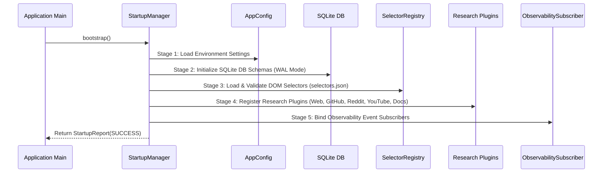
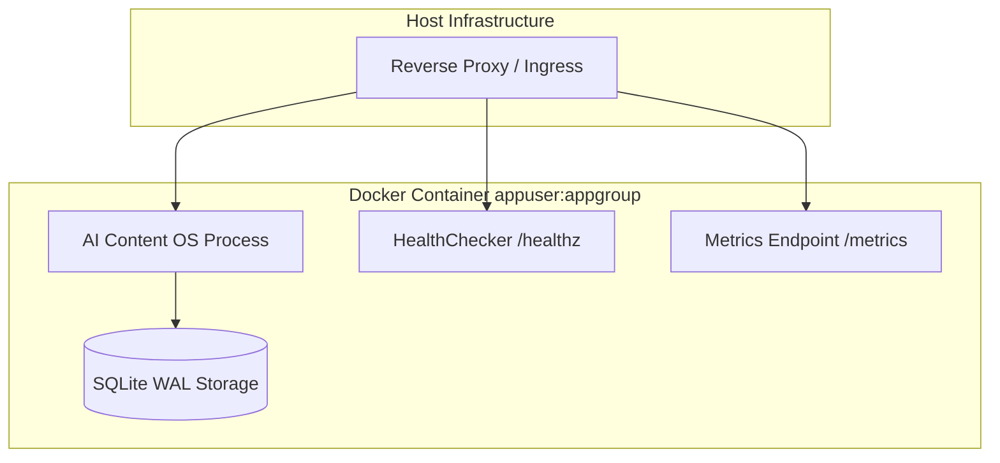

# Infrastructure Subsystem 🛡️

The Infrastructure subsystem handles production environment configuration (`AppConfig`), application bootstrap (`StartupManager`), readiness probes (`HealthChecker`), and container deployment manifests.

---

## 1. Purpose

Ensures secure, reproducible application bootstrapping, credential protection, health readiness reporting, and containerized deployment across development, staging, and production environments.

---

## 2. 5-Stage Startup Sequence Diagram

---

## 3. Container Deployment Architecture

---

## 4. Core Components

- **`AppConfig`**: Strongly typed environment settings with `SecretStr` credential masking.
- **`StartupManager`**: Executes 5-stage bootstrap sequence and produces structured `StartupReport`.
- **`HealthChecker`**: Performs system readiness probes and returns strongly typed `HealthStatus`.

---

## 5. Security & Credentials

- **Non-Root System Execution**: Production Docker containers run as non-root user `appuser:appgroup` (uid 10001).
- **`SecretStr` Protection**: Masks credentials (`GEMINI_API_KEY`, etc.) from logs and string representations.

---

## 6. Related Components & References

- [System Architecture Overview](overview.md)
- [Observability Pipeline](observability.md)
