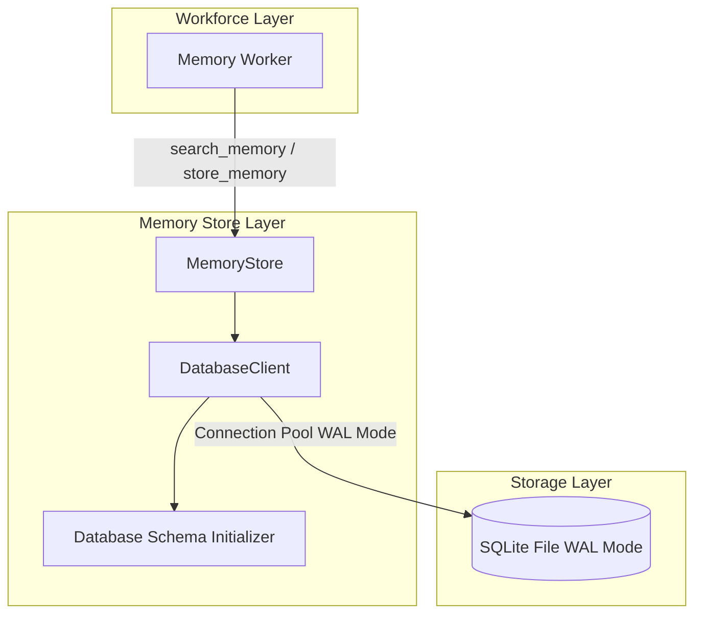

# Memory Subsystem 💾

The Memory Subsystem provides intelligent context search, storage, and retrieval powered by an embedded SQLite database.

---

## 1. Purpose

Maintains historical memory records, institutional context, and past publication content to enrich new content generation requests.

---

## 2. Memory System Architecture

---

## 3. Core Components

- **`MemoryStore`**: Primary high-level facade operating over SQLite (`user_data/database/memory_system.db`).
- **`DatabaseClient`**: SQLite database connection manager initialized with Write-Ahead Logging (`WAL mode active`).
- **`MemoryWorker`**: Production worker that queries `MemoryStore` for relevant institutional knowledge during workflow execution.

---

## 4. Design Decisions & WAL Mode

- **WAL Mode (`PRAGMA journal_mode=WAL;`)**: Allows concurrent reads while writes are processing, eliminating database locked errors.
- **Auto-Initialization**: Database schema is automatically created on application startup by `StartupManager`.

---

## 5. Related Components & References

- [System Architecture Overview](overview.md)
- [AI Workforce Architecture](workforce.md)
