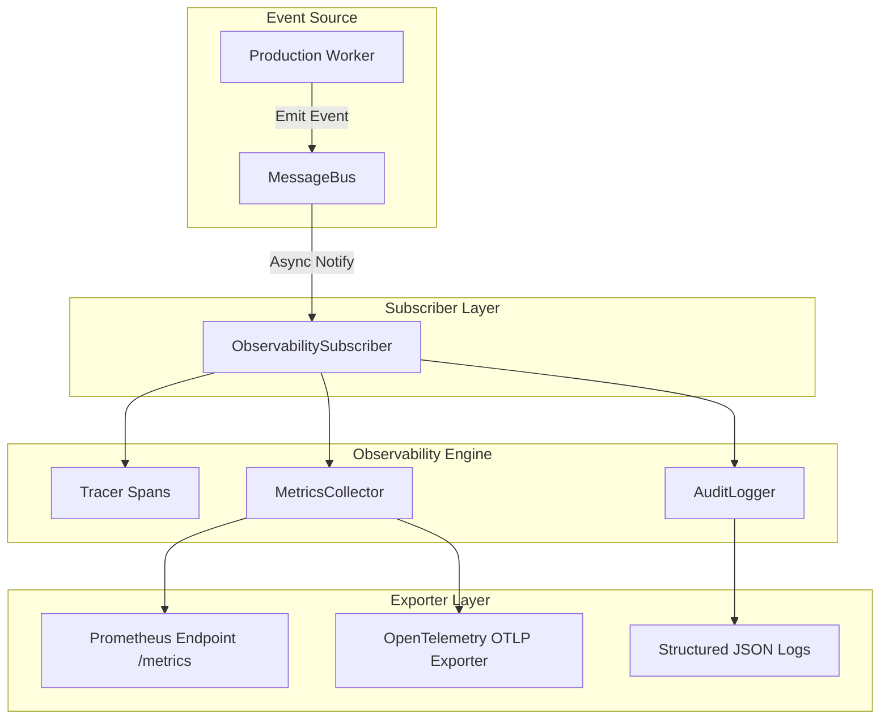

# Observability Subsystem 📊

The `ObservabilityManager` delivers thread-safe distributed tracing, metrics aggregation (counters, histograms, gauges), structured audit logging, and Prometheus/OpenTelemetry exporters.

---

## 1. Purpose

Provides enterprise operational visibility into system performance, worker execution latencies, step failures, and audit trails without modifying production worker contracts or introducing latency overhead.

---

## 2. Observability Telemetry Pipeline

---

## 3. Core Components

- **`ObservabilityManager`**: Primary facade for distributed tracing, metrics aggregation, and audit logging.
- **`Tracer`**: Manages parent-child span context with 5-field metadata (`correlation_id`, `workflow_id`, `worker_id`, `request_id`, `execution_id`).
- **`MetricsCollector`**: Thread-safe in-memory metrics store computing counters, gauges, and p95 latency histograms.
- **`ObservabilitySubscriber`**: Asynchronous `MessageBus` listener that decouples telemetry collection from worker execution.

---

## 4. Design Decisions & Non-Blocking Isolation

- **Asynchronous Decoupling**: Telemetry event handlers execute in non-blocking try-except blocks, ensuring telemetry failures never interrupt content production.
- **Bounded Buffers**: Trace spans, metric points, and audit logs use bounded in-memory queues (`deque(maxlen=10000)`), preventing memory leaks.

---

## 5. Related Components & References

- [System Architecture Overview](overview.md)
- [Infrastructure & Deployment](infrastructure.md)
