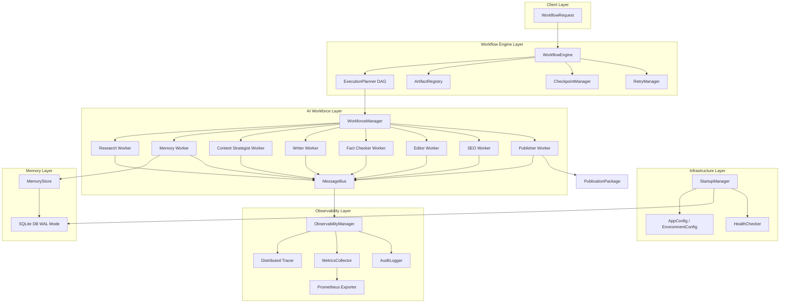
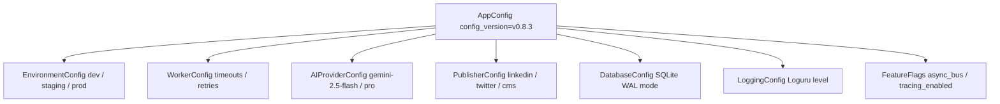

# System Architecture Overview 🏗️

AI Content OS is an enterprise-grade autonomous AI workforce and pipeline orchestration engine built on Python 3.14, Pydantic v2, Loguru, and SQLite.

---

## 1. Purpose

The System Architecture defines the component interaction model, abstraction boundaries, data flow pipelines, and resilience mechanics across the 5 core subsystems of AI Content OS. It ensures decoupled, strongly-typed execution from initial workflow request to final multi-platform publication.

---

## 2. Complete System Architecture

---

## 3. Configuration Hierarchy

---

## 4. Subsystem Responsibilities & Interactions

| Subsystem | Primary Class | Key Interactions |
| :--- | :--- | :--- |
| **Workflow Engine** | `WorkflowEngine` | Interacts with `WorkforceManager` to execute DAG steps, `ArtifactRegistry` for typed inputs/outputs, `CheckpointManager` for state persistence, and `RetryManager` for error recovery. |
| **AI Workforce** | `WorkforceManager` | Manages 8 specialized `BaseWorker` instances, emits events over `MessageBus`. |
| **Memory System** | `MemoryStore` | Provides SQLite query resolution for `MemoryWorker` with WAL mode concurrency. |
| **Observability** | `ObservabilityManager` | Subscribes asynchronously to `MessageBus` via `ObservabilitySubscriber` to generate spans, histograms (p95), and audit logs. |
| **Infrastructure** | `StartupManager` | Orchestrates 5-stage application bootstrap and registers readiness probes with `HealthChecker`. |

---

## 5. Design Decisions

- **Explicit Subsystem Decoupling**: Subsystems communicate strictly through typed interfaces (`WorkflowContext`, `ArtifactRegistry`, `MessageBus`), prohibiting direct cross-layer private state mutation.
- **Pydantic v2 Contract Enforcements**: All inputs, outputs, and configs inherit from `BaseModel`, guaranteeing strict schema validation.
- **In-Memory Event Bus with Async Dispatch**: System events are broadcast over `MessageBus` to keep worker execution overhead under 50ms.

---

## 6. Trade-offs

- **SQLite WAL Mode vs. External Postgres**: SQLite eliminates external infra dependencies for local/edge deployments; high-concurrency multi-node setups require future database driver abstraction.
- **In-Memory Event Bus vs. Kafka**: Keeps local latency minimal while requiring future queue adapter for multi-server fanout.

---

## 7. Failure Handling

- **Step Isolation**: Single worker failures trigger `RetryManager` exponential backoff without corrupting global application state.
- **Atomic Checkpointing**: Process crashes resume cleanly from disk JSON checkpoints (`user_data/checkpoints/`).

---

## 8. Scalability & Extension Points

- **Custom Workers**: Implement `BaseWorker` and register with `WorkforceManager`.
- **Custom Workflow Templates**: Register custom DAG topologies in `WorkflowTemplate` registry.

---

## 9. Related Components & References

- [AI Workforce Architecture](workforce.md)
- [Workflow Engine & Checkpoints](workflow_engine.md)
- [Memory Subsystem](memory_system.md)
- [Observability Pipeline](observability.md)
- [Infrastructure & Deployment](infrastructure.md)
