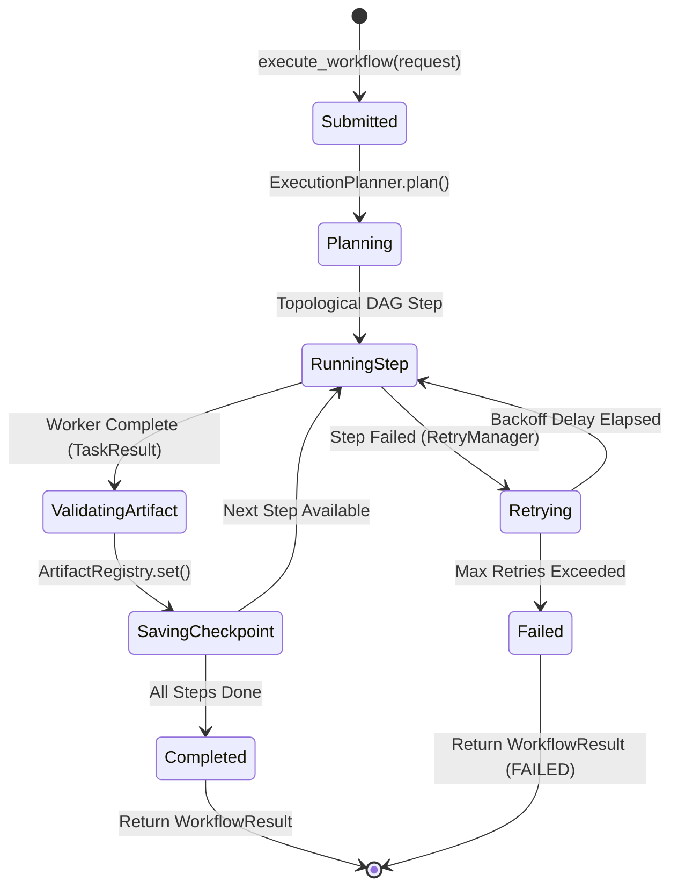
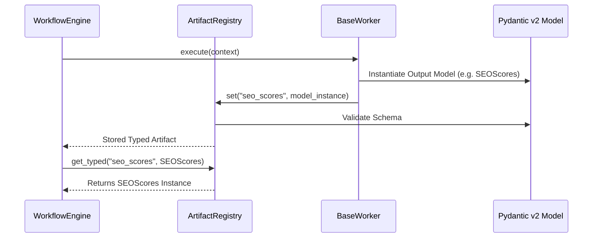
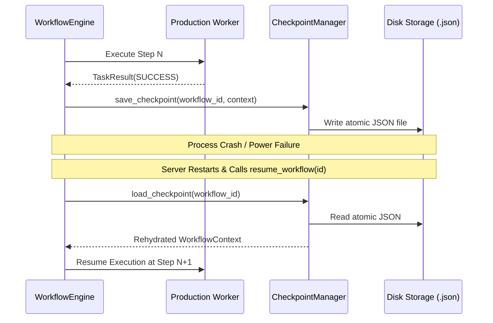

# Workflow Engine Subsystem ⚡

The `WorkflowEngine` controls topological execution planning, artifact typing, atomic state saving, and crash recovery.

---

## 1. Purpose

Orchestrates the lifecycle of content workflows, enforcing DAG execution order, type-safe artifact propagation (`ArtifactRegistry`), transient retry policies (`RetryManager`), and zero-data-loss checkpoint recovery (`CheckpointManager`).

---

## 2. Workflow Engine Lifecycle State Machine

---

## 3. Artifact Registry Data Flow

---

## 4. Atomic Checkpoint & Crash Recovery Sequence

---

## 5. Design Decisions

- **Atomic JSON Checkpointing**: Saves full execution state snapshots to disk after every completed step (`user_data/checkpoints/{workflow_id}.json`).
- **Strongly Typed Registry**: `ArtifactRegistry` uses `get_typed(key, ModelClass)` to guarantee type safety between worker steps.

---

## 6. Trade-offs

- Disk I/O overhead on step completion vs. crash recovery safety (I/O latency is <5ms per step).

---

## 7. Related Components & References

- [System Architecture Overview](overview.md)
- [AI Workforce Architecture](workforce.md)
