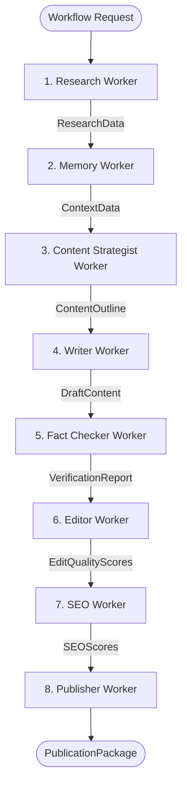

# AI Workforce Subsystem 🤖

The AI Workforce subsystem manages the lifecycle and execution of 8 specialized production AI workers under `WorkforceManager`.

---

## 1. Purpose

Provides a modular, single-responsibility worker workforce where each worker performs a distinct stage of content research, drafting, verification, editing, SEO optimization, and syndication.

---

## 2. Workforce Execution DAG



---

## 3. Worker Catalog & Responsibilities

| Worker | Class Name | Output Artifact | Key Responsibility |
| :--- | :--- | :--- | :--- |
| **Research Worker** | `ResearchWorker` | `ResearchData` | Queries multi-source research plugins (`WebPlugin`, `GitHubPlugin`, `RedditPlugin`, `YouTubePlugin`, `DocumentationPlugin`). |
| **Memory Worker** | `MemoryWorker` | `ContextData` | Queries SQLite `MemoryStore` for institutional context. |
| **Content Strategist** | `ContentStrategistWorker` | `ContentOutline` | Builds target platform specifications and structural outlines. |
| **Writer Worker** | `WriterWorker` | `DraftContent` | Drafts multi-section content matching audience and tone. |
| **Fact Checker** | `FactCheckerWorker` | `VerificationReport` | Verifies claims, computes confidence scores, flags issues. |
| **Editor Worker** | `EditorWorker` | `EditQualityScores` | Enhances grammar, readability, and structural flow. |
| **SEO Worker** | `SEOWorker` | `SEOScores` | Keyword density analysis, meta tags, schema templates. |
| **Publisher Worker** | `PublisherWorker` | `PublicationPackage` | Formats platform payloads (LinkedIn, X, CMS) and links. |

---

## 4. Worker Interface & Lifecycle

Every production worker inherits from `BaseWorker`:

```python
class BaseWorker(ABC):
    @abstractmethod
    async def execute(self, context: WorkflowContext) -> TaskResult:
        """Executes worker logic and returns a TaskResult with output artifacts."""
        pass
```

---

## 5. Design Decisions & Trade-offs

- **Single-Responsibility Workers**: Each worker handles exactly one domain task, preventing bloated prompt monoliths.
- **Strict Payload Contracts**: Workers communicate via `ArtifactRegistry` rather than modifying global mutable state.

---

## 6. Failure Handling

- Worker timeouts or execution exceptions trigger `RetryManager` exponential backoff (default max 3 retries).
- Persistent worker failures produce a `TaskResult(status=FAILED)` caught by `WorkflowEngine`.

---

## 7. Related Components & References

- [System Architecture Overview](overview.md)
- [Workflow Engine & Checkpoints](workflow_engine.md)
